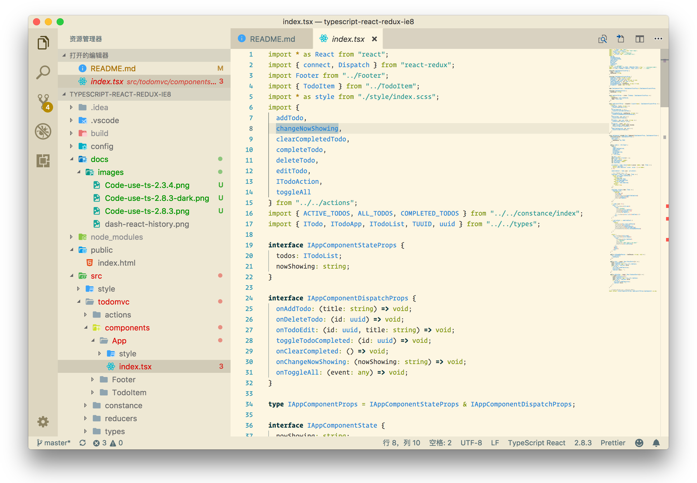

# TypeScript-React-Redux (IE8+)
本项目是一个兼容IE8的 TypeScript + React + Redux + immutablejs 的项目模板。
为了降低上手难度，我在项目中写3个DEMO：
- todomvc without immutabeljs (ts + react + redux)
- [todo] todomvc with immutablejs (ts + react+ redux + immutablejs)
- [todo] hackernews (ts + react + redux + immutablejs)

使用时，只需要把这些文件夹删掉就好了。

## Show me the code
Code在此：[TypeScript-React-redux-ie8](https://github.com/hifizz/typescript-react-redux-ie8)  
Demo在此：[Todomvc-Typescript-react-redux-immutable](https://hifizz.github.io/typescript-react-redux-ie8/demo/index.html)

## Usage
使用方法很简单，只需要把项目克隆到本地，然后安装依赖就可以跑起来了。
```bash
$ git clone https://github.com/hifizz/typescript-react-redux-ie8.git

# 为了顺利的安装依赖，这里最好是使用cnpm，npm, 不要使用yarn
# 有以下几点原因：
# 1.yarn 会更新某些依赖，造成不可知错误。(redux 会依赖 react@16.x.d.td)
# 2.node-sass很容易安装失败。
$ cnpm install

# 安装完依赖之后，如果你用 VS Code 打开，它极大概率上用的是最新版本的 TypeScript
# 这会报一些错误，可能让你感到疑惑，可见下贴图。

# then open http://localhost:8800 in your browser.
$ cnpm start

# 在IE8浏览器上打开（ie8，9不支持socket，所以不能热更新，下面命令可以手动刷新）
# then open http://localhost:9900 in your browser
$ npm start:ie
```

> 在 VS Code 中打开时需要设置TypeScript版本




## 其他的一些命令
```bash
# compile src to target code
$ npm run build

# format code style by prettier
$ npm run format
```

---

## Feature
- 兼容IE8
- TypeScript && ES6/ES7/ES8 语法
- [css-modules](https://github.com/css-modules/css-modules)
- [Prettier](https://prettier.io/)
- [tslint](https://github.com/palantir/tslint)
- Webpack@1.x
- Promise
- React@0.14.9
- [Redux](https://github.com/reactjs/redux) 状态管理
- [Redux-thunk](https://github.com/gaearon/redux-thunk)
- [ts-jest](https://github.com/kulshekhar/ts-jest)
- [immutablejs](https://github.com/facebook/immutable-js)
- [typedoc](https://github.com/TypeStrong/typedoc)
- webpack-dev-server 热更新、无刷新，IE8 可以手动刷新（不支持websocket）

> React 版本为0.14.9，使用了ES6的最新语法编写，（万一有一天，万一...）可以无缝过渡到React新版本，也可以同一套代码使用两个不同版本的React输出两套代码跑在不同的浏览器上

### 如何兼容IE8
#### 兼容IE8的本质是什么
- 模拟 ES5 ES6 新api
- 用[""]引用 IE8 下某些保留关键字
- 模拟 console
- 避免使用`Object.definePropotype`，或者使用替代方式

1.IE8全面支持ES3的规范，但完全不支持ES5（IE9支持部分ES5，不完全），所以ES5的API需要模拟。因此我们需要`polyfill`和`shim`。因此我们需要使用`es5-shim`,同时引用`es5-shim/sham`。IE8也不支持console，具体表现是IE8下console为undefined，于是需要把这货定义一下，把console的各种方法用空函数代替。同时，我们使用ES6的语法来编写源代码，ES5和ES6的新API在IE8上是没有的，我们需要`babel-polyfill`帮助补齐。看到这里，貌似一切万事大吉，但是，凡事有个但是，ES5定义的`Object.definePropotype`这个api是无法完全模拟出来的，即使是上面的`es5-shim`。关于这一点，社区的解决方案是：不使用这个api，可现有大部分第三方都是用这个api来定义属性的。解决方案：
- babel preset loose = true
- TypeScript target = es3

#### 兼容的做法:
- shim & polyfill
- TS target 设置为 `es3`
- post-loader 使用 es3-loader
- uglyifyjs 解决IE8 问题

以上步骤缺一不可。

本项目为了兼容ie8，使用了低版本的react@0.14.9、webpack@1.12.9和react-router@1.0.2，
使用上与高版本的可能不同，文档可参考根目录下node_molules对应的每个包的docs。

细节往下看这里。

#### shim & polyfill
```bash
$ npm i es5-shim
$ npm i console-polyfill
$ npm i babel-polyfill
$ npm i es6-promise
```

```js
// webpack.config.js
module.exports = {
  entry: {
    vendors: [
      "es5-shim",
      "es5-shim/es5-sham",
      'console-polyfill',
      'babel-polyfill',
      'es6-promise',
      'fetch-ie8',
      'qs'
    ]
  }
}
```

#### TypeScript target 设置为 `es3`
在根目录下有一份 `tsconfig.json` 文件，这是 TypeScript 的项目配置文件，类似于babel，在项目下有一个`.babelrc`。
只要将其中的 compilerOptions.target 设置为 `es3` 即可。这代表TypeScript将会把源代码转译成 ES3 规范下可跑的代码。

```json
// tsconfig.json
{
  "compilerOptions": {
    "target": "es3"
  }
}
```

### CSS 解决方案
本项目采用SASS + PostCSS + CSS Module 编写和处理CSS。CSS Module 是一个Scope CSS的方案。PostCSS 后处理器主要用到了[`autoprefixer`](https://github.com/postcss/autoprefixer)和[`cssnano`](http://cssnano.co/)两个插件，前者是用来给浏览器自动添加前缀的--基于[`caniuse`](http://caniuse.com/)的数据。SASS的使用纯属个人喜好，毕竟我已经使用SASS三年了。
对于本项目来说，CSS的编译过程是这样的：编写SCSS文件 -> SASS编译 -> PostCSS autoprefixer -> CSS loader -> Style loader。

#### CSS 目录组织
可选的style目录风格。
```bash
.root
├── src
│   ├── style
│   │   ├── global.scss
│   │   ├── helper.scss
│   │   ├── mixins.scss
│   │   ├── placeholder.scss
│   │   ├── theme.scss
│   │   └── variables.scss
```
此目录的设计是因为SCSS 和 CSS Module结合，必然会有一些SASS的基本函数、placeholder、mixin，需要一个helper帮助你管理它们。
因此这个目录是完全公用的。在目录外你只需引入`helper.scss`即可。`global.scss`则是一些项目通用的CSS，例如reset的css。
`mixins.scss` `placeholder.scss` `theme.scss` `variables.scss` 则是被 `helper.scss` 引用，你不必多关心。

#### CSS Module
下面是 CSS Module 方案和纯 SCSS 方案的一个对比：

**before**
```js
import * as React from "react";
import "./index.scss";

class App extends React.Component {
  render() {
    return (
      <div className="app-container">
        <div className="app-header">header</div>
        <div className="app-content">content</div>
      </div>
    )
  }
}
```
```scss
.app-container {
  color: #4d4d4d;
}
.app-header {
  background-color: green;
}
.app-content {
  background-color: red;
}
```

**after**
```js
// ./src/app.tsx
import * as React from "react";
import * as style from "./index.scss";

class App extends React.Component {
  render() {
    return (
      <div className={style.container}>
        <div className={style.header}>header</div>
        <div className={style.content}>content</div>
      </div>
    )
  }
}
```

```scss
// ./src/index.scss
.container {
  color: #4d4d4d;
}
.header {
  background-color: green;
}
.content {
  background-color: red;
}
```

### 一些重要问题以及解决方案
#### 如何查找开源库旧版本文档
初始，我知道React0.14.9是支持IE8的，于是我在Google上开始搜索TypeScript为什么不支持IE8，于是得到一些issue信息，TypeScript是支持IE8的，但是某些版本有问题。翻了十几条issue的大楼之后得到信息，TypeScript@2.3.4可以很好的运行。这解决了第一个问题。接下来我需要确定React配套的状态管理库，redux使用哪个版本。这个问题比较纠结，

接下来我遇到一堆问题这些旧版本库，我怎么知道它怎么用呢？API有哪些？参数是什么类型的？

不要慌不要慌，太阳落了有月光。

为了解决这个问题，我可没少费心思。经过探索，主要方式有以下几种：
- Dash
- GitHub 源码

##### Dash


#### TypeScript 如何和 `React-redux` 结合
```tsx
// 单纯 TypeScript + React 模板
import * as React from 'react';

interface IAppProps {
  name: string;
  age?: number;
}

interface IAppState {
  color: blue;
}

class App extends React.Component {
  render() {
    const props = this.props;
    return (
      <div>
        <div>hello App</div>
        <div>{`${props.name} now is ${props.age} years old. His color is ${this.state.color}`}</div>
      </div>
    )
  }
}

export default App
```

```tsx
// TypeScript + React + redux 模板
import React from 'react';
import { connect, Dispatch } from 'react-redux';

interface IAppStateProps {}

interface IAppDispatchProps {}

type IAppProps = IAppStateProps & IAppDispatchProps;

interface IAppState {}

class App extends React.Component<IAppProps, IAppState> {
  public render() {
    return (
      <span>Body</span>
    );
  }
}

const mapStateToProps = (state: any): IAppStateProps => {
  return {
      // ...mapStateToProps
  };
};

const mapDispatchToProps = (dispatch: Dispatch<any>): IAppDispatchProps => {
  return {
    // ...mapDispatchToProps
  };
};

export default connect(
  mapStateToProps,
  mapDispatchToProps,
)(App);
```

#### TypeScript 如何 使用 CSS Module
1.安装 `typings-for-css-modules-loader` [GitHub](https://github.com/Jimdo/typings-for-css-modules-loader)

### 兼容IE8的一些前端框架：
- 京东的nerv [Nerv – 京东高性能前端框架](http://jdc.jd.com/archives/212126)
- 腾讯的[Omi(x)](https://github.com/AlloyTeam/omi)
- 百度的[san](https://github.com/baidu/san)
- 司徒正美的[anu](https://github.com/RubyLouvre/anu) [avalon](https://github.com/RubyLouvre/avalon)

### CHANGELOG
- 每次新加功能需要修改 CHANGELOG.md 以便溯源追踪。书写规则请仔细阅读[CHANGELOG规范](https://keepachangelog.com/en/1.0.0/)。

### TODO
- webpack config 设置多个环境
- webpack merge

### problem
- 现在的webpack uglifyJS plugin 混淆之后的代码不能在ie8上运行 [https://github.com/SamHwang1990/blog/issues/6](https://github.com/SamHwang1990/blog/issues/6)
